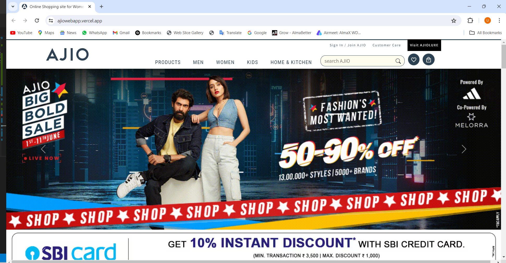
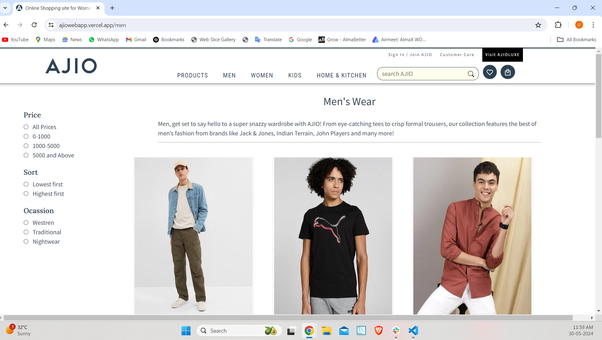

# AJIO WebApp

Welcome to the Ajio Web Application! This is a full-stack e-commerce platform built with React.js and other technologies. The application allows users to browse products, add them to the cart, make purchases, and manage their profiles.

## Table of Contents

- [Project Description](#project-description)
- [Features](#features)
- [Technologies Used](#technologies-used)
- [Installation](#installation)
- [Usage](#usage)
- [Deployment](#deployment)
- [Contributing](#contributing)
- [License](#license)

## Project Description

This is a front-end development project for the Ajio WebApp. The key aspects of development include:

1. **Frontend Interface Development:** Create a visually appealing frontend interface inspired by AJIO, incorporating modern design principles and elements.

2. **User Authentication and Cart Management:** Integrate features for user login, signup, and cart management based on the provided API documentation, ensuring smooth interaction and data handling.

3. **Browse Products Without Login/Signup:** Allow users to browse products without the need for login/signup, enhancing accessibility and user experience.

4. **Data Management with Redux Toolkit or Thunk or Saga:** Implement robust data management using Redux Toolkit, Thunk, or Saga, ensuring efficient state management and data flow.

5. **Authentication Redirect:** Redirect users to the login/signup page when attempting to add items to the cart or proceed to buy now if they're not logged in, ensuring security and user authentication.

6. **Authentication Methods:** Utilize Firebase, JWT, or OAuth authentication methods based on the provided API documentation, ensuring secure and reliable user authentication.

7. **UI/UX Design:** Utilize Tailwind, Bootstrap, Material UI, or any preferred library for UI/UX design, ensuring a visually appealing and intuitive frontend for seamless navigation and interaction.

8. **Search Functionality:** Implement search functionality to enable users to search for products easily, enhancing user convenience and product discovery.

9. **Thorough Testing:** Test the application thoroughly to ensure all functionalities work as expected, providing a seamless and bug-free user experience.

10. **Documentation and Deployment:** Document the development process, challenges faced, and solutions implemented, provide clear instructions for deploying and accessing the application, and ensure ease of use for developers and users alike.

## Features

- Frontend Interface Development
- User Authentication and Cart Management
- Browse Products Without Login/Signup
- Data Management with Redux Toolkit or Thunk or Saga
- Authentication Redirect
- Authentication Methods
- UI/UX Design
- Search Functionality
- Thorough Testing
- Documentation and Deployment

## Technologies Used

- React
- HTML5 & CSS3
- JavaScript (ES6+)
- Git & GitHub
- Material UI
- Redux Toolkit
- OAuth

## Installation

To run this project locally, follow these steps:

1. Clone the repository:
   \`git clone https://github.com/Ujwaldevgade/AJIO_WebApp.git\`
2. Navigate to the project directory:
   \`cd AJIO_WebApp\`
3. Install dependencies:
   \`npm install\`

## Usage

After installing the dependencies, you can start the development server:

\`npm start\`

This will run the application in development mode on \`http://localhost:3000\`.

## Deployment

The Ajio Web Application is deployed and accessible at https://ajiowebapp.vercel.app/.

## Contributing

Contributions to this project are welcome! Please follow these guidelines:

1. Fork the repository
2. Create a new branch (\`git checkout -b feature-branch\`)
3. Make your changes
4. Commit your changes (\`git commit -am 'Add new feature'\`)
5. Push to the branch (\`git push origin feature-branch\`)
6. Create a new Pull Request

## License

This project is licensed under the [MIT License](https://opensource.org/licenses/MIT) - see the [LICENSE](LICENSE) file for details."
